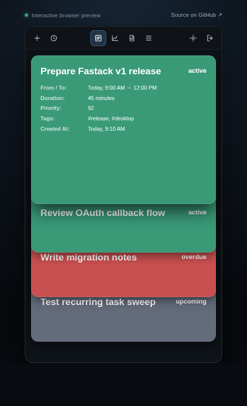

# Fastack

Fastack is a keyboard-first task manager that lives in the desktop menu bar. It keeps the next task visible, records focused time, and turns a backlog into a stack you can work from the top down.

Tasks are ordered by schedule and priority: overdue work comes first, followed by tasks without dates, work due today, and upcoming tasks. Finish the current task and pop it from the stack.



## What Fastack includes

| Area | Current behavior |
|---|---|
| Task stack | Create, edit, inspect, prioritize, schedule, tag, time, and complete tasks from a layered stack. |
| Focus timer | Clock in and out, preserve time across navigation, record sessions, and transfer a timer that is active on another device. |
| Productivity | Review focus time, active time, completions, streaks, interruptions, work patterns, estimate accuracy, recommendations, stale tasks, and recent accomplishments. |
| Task intelligence | Find semantically related tasks, suggest estimates from completed work, rank useful next steps, and break large tasks into smaller steps. |
| Recurring work | Create daily, weekly, or monthly templates; preview their next run; pause them; or remove them in Settings. |
| SOP library | Create searchable, versioned procedures, compose child SOPs, add approval gates, inspect dependency impact, and start a task from an SOP. |
| Rich notes | Write Markdown notes with tables, syntax-highlighted code, charts, UML, colors, and merged table cells through Toast UI Editor. |
| Task lists | Keep separate local or provider-backed workspaces and switch between them without losing their cached state. |
| Storage | Work entirely locally or synchronize snapshots through GitHub, Dropbox, or Google Drive. |

The redesigned interface uses one navigation bar for **Tasks**, **Productivity**, **SOPs**, and **Lists**. The tray popup supports three fixed layouts—Compact (`300 × 420`), Standard (`340 × 560`), and Large (`400 × 680`)—and can snap back beneath the tray icon. A built-in onboarding tour and shortcut compass explain the current screen without leaving the app.

## Local AI and document context

Fastack can index a folder of documentation or source code and retrieve related passages while you create a task. Document retrieval uses `Xenova/all-MiniLM-L6-v2`. Optional note generation and description summaries use `Xenova/Qwen1.5-1.8B-Chat` in a separate local worker so model loading does not block the popup.

These features are opt-in. The generative model requires an approximately 1.9 GB first-use download; after the model files are cached, generation runs locally. You can choose, reindex, or clear the document folder from Settings.

## Privacy

Fastack keeps a local mirror of each stack and writes cloud data only to the storage provider you select. Stack snapshots can be encrypted with a password before storage.

Productivity tracking runs only while a task is clocked in. Fastack records timestamps, idle state, and coarse activity categories. Scrolling is counted inside the Fastack popup. Optional system-wide keyboard tracking counts key-down events in an isolated worker; it never stores key values or typed content. Productivity analytics do not retain window titles, application names, clipboard data, mouse positions, or screenshots.

See [RELEASE.md](RELEASE.md) for the complete activity-data description and release validation steps.

## Storage and synchronization

Choose a backend during the first run:

| Backend | Snapshot location |
|---|---|
| Local | `<userData>/fastack-local/local/<year>/<month>/<day>` |
| GitHub | `<repository>/<year>/<month>/<day>`; a private repository is recommended |
| Dropbox | `/Fastack-<name>/<year>/<month>/<day>` |
| Google Drive | `Fastack-<name>/<year>/<month>/<day>` |

Fastack keeps provider-backed stacks mirrored locally for quick startup and recovery. When it loads history from more than one source or device, the merge layer reconciles stable task IDs, completed tasks, timer sessions, recurring templates, and competing description edits. Task locks prevent two devices from timing the same task silently; the active timer can be transferred explicitly.

You can begin in Local mode and later open **Settings → Push local stack to cloud** to migrate the full snapshot history to GitHub, Dropbox, or Google Drive.

## First run

1. Launch Fastack and click its tray or menu-bar icon.
2. Choose **Local**, **GitHub**, **Dropbox**, or **Google Drive**.
3. Complete OAuth for a cloud provider. Local mode does not require an account.
4. Name the repository, folder, or task list that will hold the stack.
5. Set an optional encryption password and create the first task.

GitHub and Google authentication use a dedicated browser window. Dropbox uses its external authorization and paste-code flow. Returning users load and reconcile their latest available snapshots automatically.

## Keyboard controls

Every shortcut can be changed in Settings. The defaults are:

| Action | Shortcut |
|---|---|
| Open or close Fastack | `Alt+Z` |
| New task or current-page item | `Alt+N` |
| Edit selected item | `Alt+E` |
| Clock in / transfer timer | `Alt+C` |
| Clock out | `Alt+V` |
| Complete or delete selected item | `Alt+P` |
| Move through the current collection | `Alt+↑` / `Alt+↓` |
| Open task, SOP, or list | `Alt+Enter` |
| Move between Tasks, Productivity, SOPs, and Lists | `Alt+←` / `Alt+→` |
| Return to Tasks | `Alt+Backspace` |
| Open Settings | `Alt+S` |
| Cycle Compact, Standard, and Large layouts | `Alt+Shift+S` |
| Reset the window beneath the tray icon | `Alt+Shift+R` |
| Show the shortcut compass | `Alt+/` |
| Log out | `Alt+L` |

Entity shortcuts follow the active screen. For example, `Alt+N` creates an SOP in the SOP library and a task list on the Lists screen, while task-only actions are ignored where no task is selected.

## Run from source

Fastack requires Node.js 18 and npm 8 or newer. The repository pins Node `18.9.0` in `.tool-versions`.

```bash
git clone https://github.com/Prog-Ramen/FastackDesktop.git
cd FastackDesktop
npm install --no-audit
npm start
```

For UI development, open DevTools automatically and skip provider login:

```bash
FASTACK_LOCAL=1 npm run dev
```

`FASTACK_DEV=1` enables DevTools when invoking Electron directly. `FASTACK_LOCAL=1` opens the default local stack.

## Test and package

```bash
npm test                    # unit and mocked provider tests
npm run test:integrations:live  # optional live provider round trips
npm run pack                # unpacked application for local smoke testing
npm run dist                # installer for the current platform
```

Platform-specific packaging commands are also available:

| Command | Output |
|---|---|
| `npm run dist:mac` | Universal macOS DMG and ZIP |
| `npm run dist:win` | Windows NSIS installer |
| `npm run dist:linux` | Linux AppImage and Debian package |

Artifacts are written to `release/`. The current installers are unsigned; see [RELEASE.md](RELEASE.md) before distributing them. Live backend tests require short-lived credentials through environment variables documented in that file.

## Architecture

| Component | Responsibility |
|---|---|
| `main.js` | Electron lifecycle, tray placement, fixed window layouts, global shortcuts, isolated workers, and IPC. |
| `home.html` and `loginGithub.js` | Backend selection, OAuth, first-run routing, history reconciliation, and local-to-cloud migration. |
| `helper/*_functions.js` | Interchangeable GitHub, Dropbox, Google Drive, and local storage adapters. |
| `helper/stack_functions.js` | Stack ordering, task rendering, persistence, recurring templates, focus timers, and timer handoff. |
| `helper/task_merge.js` | Deterministic reconciliation of tasks, conflicts, completions, templates, and time sessions. |
| `helper/intelligence.js` and `helper/activity_tracker.js` | Task recommendations, estimates, focus analysis, summaries, and privacy-bounded activity samples. |
| `helper/rag.js` and `helper/gen_worker.js` | Local document indexing, semantic retrieval, model caching, and task-note generation. |
| `helper/sop_repository.js` and `helper/sop_engine.js` | Versioned SOP storage, composition, permission planning, approval gates, and execution. |
| `stack/` | Task, detail, report, SOP, list, settings, tutorial, and rich-note interfaces. |

The executable SOP safety model and planned adapter boundaries are documented in [SOP_ARCHITECTURE.md](SOP_ARCHITECTURE.md).

## Contributing

Issues and pull requests are welcome in [Prog-Ramen/FastackDesktop](https://github.com/Prog-Ramen/FastackDesktop). Fastack is available under the [MIT License](LICENSE).
